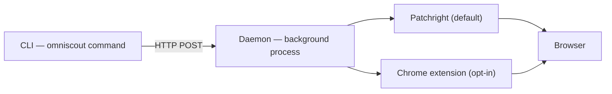

OmniScoutは3つの部分で構成されます：

1. **CLI** — 入力する`omniscout`コマンドです（Typer＋Rich）。フラグを解釈し、人間向けまたはJSON出力を表示します。
2. **daemon** — `127.0.0.1:7720`で動作する長時間稼働のHTTPサーバーで、ブラウザタブ、ウォーム済み埋め込みモデル、ベクトルストアを所有します。
3. **バックエンド** — 実際にブラウザを動かすPatchright（デフォルト）またはChrome拡張機能（オプトイン）です。

daemonがコマンド間で起動したままになるため、ブラウザ、モデル、インデックスはウォームに保たれます — 呼び出しごとに起動コストを払わず、すべての操作が1秒未満になります。

## 主要概念

### `@eN` ref

`snapshot`はページのアクセシビリティツリーを安定した要素ref（`@e1`、`@e2`、…）付きで返します。操作はrefを対象とします — `click '@e3'`、`fill '@e5' "text"` — そのためCSSやレイアウトの変更に強いフローになります。ナビゲーションでrefは無効になります：ページが変わるたびに再取得します。[ブラウザ自動化](/docs/cli/browser)をご覧ください。

### daemon

`omniscout daemon start`で一度起動します。停止していればほとんどのコマンドが自動起動します。daemonが所有するもの：

- **アクションキュー** — セッションごとに順序付けされたブラウザコマンドの単一ストリームです。
- **snapshot世代** — 各`snapshot`は次の操作が解決対象とするref世代を固定します。
- **操作履歴とreplay** — 直近1万コマンドのJSONL形式です（`daemon trace`）。再実行（`daemon replay`）やmacroへの記録（`record`／`macro`）が可能です。
- **セッション復元** — 再起動後にセッションとプロファイルを再接続します。
- **イベントストリーム** — エージェント監視向けライブSSEフィード（`daemon watch`）です。

### バックエンド

- **Patchright**（デフォルト） — 永続プロファイル付きの独自Chromiumを起動します。分離され、セットアップ不要です。
- **Extension**（オプトイン） — 実際のログイン状態や拡張機能を持つ実際のChrome／Braveを操作します。`omniscout setup --browser <id>`でセットアップします。ポップアップに`backend_unavailable`と出る場合は`chrome://extensions`を確認するか、`--backend extension`を外してPatchrightにフォールバックします。

### セッション

`--session`名は稼働中daemon内のタブグループです — 並列ワークフローが1つのdaemonを共有しても干渉しません。`omniscout session …`で管理します。[daemonとセッション](/docs/cli/sessions)をご覧ください。

### プロファイル

`--profile`名はディスク上の永続ユーザーデータディレクトリです — Cookieやログインは再起動後も残ります。`omniscout profile create work`してあらゆる場所で`--profile work`を使い、`browser login`で一度ログインします。[daemonとセッション](/docs/cli/sessions)をご覧ください。

## エンジンとストレージ層

| 層 | 役割 |
|---|---|
| `commands/` | CLIサブコマンド（search、browser、computerなど）です |
| `engines/` | ブラウザ、検索、リサーチ、抽出、クローラーのロジックです |
| `daemon/` | HTTPサーバー、バックエンド、replay、イベントストリームです |
| `store/` | SQLiteキャッシュ、セッション、ワークフロー、メモリです |
| `models.py` | Pydantic JSON契約（`--json`の形式）です |

リサーチ呼び出しのデータフロー：`research` → 検索エンジン → クローラー → 抽出 → ローカルリランク（sentence-transformers） → 要約 → CLI出力。ページは`cache/pages/`にキャッシュし、メモリは`memory.sqlite`＋ローカルQdrantに保存します。

## データの場所

| プラットフォーム | パス |
|---|---|
| macOS | `~/Library/Application Support/omniscout/` |
| Linux | `~/.local/share/omniscout/` |

`OMNISCOUT_DATA_DIR`で変更できます。完全な配置とすべての設定キーは[設定](/docs/cli/configuration)をご覧ください。
