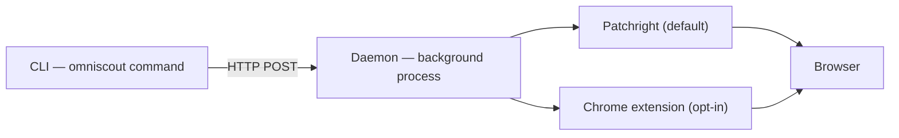

OmniScout는 세 부분으로 구성됩니다:

1. **CLI** — 입력하는 `omniscout` 명령어 (Typer + Rich). 플래그를 파싱하고 사람용 또는 JSON 출력을 보여줍니다.
2. **Daemon** — `127.0.0.1:7720`의 long-lived HTTP 서버로 브라우저 탭, 예열된 임베딩 모델, 벡터 스토어를 소유합니다.
3. **백엔드** — 실제로 브라우저를 움직이는 Patchright(기본값) 또는 Chrome extension(선택).

daemon이 명령어 사이에도 살아 있기 때문에 브라우저, 모델, 인덱스가 따뜻하게 유지됩니다 — 호출마다 시작 비용을 내지 않고 모든 동작이 1초 이내에 끝납니다.

## 핵심 개념

### `@eN` ref

`snapshot`은 안정적인 요소 ref(`@e1`, `@e2`, …)가 포함된 페이지 접근성 트리를 반환합니다. 동작은 ref를 대상으로 합니다 — `click '@e3'`, `fill '@e5' "text"` — 그래서 CSS와 레이아웃이 바뀌어도 흐름이 유지됩니다. 내비게이션하면 ref가 무효화되니 페이지가 바뀔 때마다 다시 snapshot하세요. [브라우저 자동화](/docs/cli/browser)를 참고하세요.

### Daemon

`omniscout daemon start`로 한 번 시작하세요. 꺼져 있으면 대부분 명령어가 자동으로 시작합니다. daemon이 소유하는 것:

- **동작 큐** — 세션당 하나의 순서 있는 브라우저 명령어 스트림.
- **Snapshot 세대** — 각 `snapshot`은 다음 동작이 해석 기준 삼는 ref 세대를 고정합니다.
- **동작 히스토리 및 replay** — 최근 10k 명령어의 JSONL (`daemon trace`), 다시 실행 가능 (`daemon replay`)하고 매크로로 기록 가능 (`record`/`macro`).
- **세션 복원** — 재시작 후 세션과 프로필이 다시 붙습니다.
- **이벤트 스트림** — 에이전트 모니터링용 live SSE 피드 (`daemon watch`).

### 백엔드

- **Patchright** (기본값) — OmniScout가 영속 프로필로 자체 Chromium을 실행합니다. 격리되고 설정이 필요 없습니다.
- **Extension** (선택) — 실제 로그인과 extension이 있는 실제 Chrome/Brave를 구동합니다. `omniscout setup --browser <id>`로 설정하세요. 팝업에 `backend_unavailable`이 뜨면 `chrome://extensions`를 확인하거나 `--backend extension`을 빼고 Patchright로 폴백하세요.

### 세션

`--session` 이름은 live daemon 안의 탭 그룹입니다 — 병렬 워크플로가 서로 방해 없이 하나의 daemon을 공유합니다. `omniscout session …`으로 관리하세요. [Daemon 및 세션](/docs/cli/sessions)을 참고하세요.

### 프로필

`--profile` 이름은 디스크의 영속 user-data-dir입니다 — 쿠키와 로그인이 재시작 후에도 유지됩니다. `omniscout profile create work`로 만든 뒤 everywhere `--profile work`를 쓰고, `browser login`으로 한 번 로그인하세요. [Daemon 및 세션](/docs/cli/sessions)을 참고하세요.

## 엔진 및 저장 계층

| 계층 | 역할 |
|---|---|
| `commands/` | CLI 하위 명령어 (search, browser, computer, …) |
| `engines/` | 브라우저, 검색, 리서치, 추출기, 크롤러 로직 |
| `daemon/` | HTTP 서버, 백엔드, replay, 이벤트 스트림 |
| `store/` | SQLite 캐시, 세션, 워크플로, memory |
| `models.py` | Pydantic JSON 규약 (`--json` 형태) |

리서치 호출의 데이터 흐름: `research` → 검색 엔진 → 크롤러 → 추출기 → 로컬 리랭크 (sentence-transformers) → 요약기 → CLI 출력. 페이지는 `cache/pages/`에 캐시되고 memory는 `memory.sqlite` + 로컬 Qdrant에 저장됩니다.

## 데이터 위치

| 플랫폼 | 경로 |
|---|---|
| macOS | `~/Library/Application Support/omniscout/` |
| Linux | `~/.local/share/omniscout/` |

`OMNISCOUT_DATA_DIR`로 재정의하세요. 전체 구조와 모든 설정 키: [설정](/docs/cli/configuration).
