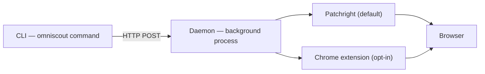

OmniScout has three parts:

1. **CLI** — the `omniscout` command you type (Typer + Rich). It parses flags and prints human or JSON output.
2. **Daemon** — a long-lived HTTP server at `127.0.0.1:7720` that owns browser tabs, the warm embedding model, and the vector store.
3. **Backends** — Patchright (default) or a Chrome extension (opt-in) that actually move the browser.

Because the daemon stays alive between commands, the browser, model, and index stay warm — every action is sub-second instead of paying startup cost per call.

## Key concepts

### `@eN` refs

`snapshot` returns the page's accessibility tree with stable element refs (`@e1`, `@e2`, …). Actions target refs — `click '@e3'`, `fill '@e5' "text"` — so flows survive CSS and layout changes. Refs go stale on navigation: snapshot again after every page change. See [Browser automation](/docs/cli/browser).

### Daemon

Start once with `omniscout daemon start`; most commands auto-start it if it's down. The daemon owns:

- **Action queue** — one ordered stream of browser commands per session.
- **Snapshot generations** — each `snapshot` pins the ref generation the next action resolves against.
- **Action history & replay** — the last 10k commands as JSONL (`daemon trace`), re-runnable (`daemon replay`) and recordable into macros (`record`/`macro`).
- **Session restore** — sessions and profiles reattach after restarts.
- **Event stream** — live SSE feed (`daemon watch`) for monitoring agents.

### Backends

- **Patchright** (default) — OmniScout launches its own Chromium with a persistent profile. Isolated, zero setup.
- **Extension** (opt-in) — drives your real Chrome/Brave with your real logins and extensions. Set up with `omniscout setup --browser <id>`; if the popup says `backend_unavailable`, check `chrome://extensions` or drop `--backend extension` to fall back to Patchright.

### Sessions

A `--session` name is a tab group inside the live daemon — parallel workflows share one daemon without stepping on each other. Managed with `omniscout session …`. See [Daemon & sessions](/docs/cli/sessions).

### Profiles

A `--profile` name is a persistent user-data-dir on disk — cookies and logins survive restarts. `omniscout profile create work`, then `--profile work` everywhere, logging in once via `browser login`. See [Daemon & sessions](/docs/cli/sessions).

## Engines and storage layers

| Layer | Role |
|---|---|
| `commands/` | CLI subcommands (search, browser, computer, …) |
| `engines/` | Browser, search, research, extractor, crawler logic |
| `daemon/` | HTTP server, backends, replay, event stream |
| `store/` | SQLite cache, sessions, workflows, memory |
| `models.py` | Pydantic JSON contracts (the `--json` shapes) |

Data-flow for a research call: `research` → search engine → crawler → extractor → local rerank (sentence-transformers) → summarizer → CLI output, with pages cached under `cache/pages/` and memory in `memory.sqlite` + local Qdrant.

## Data location

| Platform | Path |
|---|---|
| macOS | `~/Library/Application Support/omniscout/` |
| Linux | `~/.local/share/omniscout/` |

Override with `OMNISCOUT_DATA_DIR`. Full layout and every config key: [Configuration](/docs/cli/configuration).
