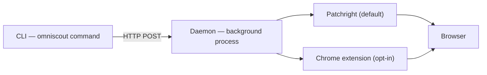

OmniScout состоит из трёх частей:

1. **CLI** — команда `omniscout`, которую вы вводите (Typer + Rich). Парсит флаги и печатает человеческий или JSON-вывод.
2. **Daemon** — долгоживущий HTTP-сервер на `127.0.0.1:7720`, владеющий вкладками браузера, тёплой embedding-моделью и векторным хранилищем.
3. **Бэкенды** — Patchright (по умолчанию) или расширение Chrome (опционально), которые реально двигают браузер.

Поскольку daemon живёт между командами, браузер, модель и индекс остаются тёплыми — каждое действие субсекундно вместо стартовой цены за вызов.

## Ключевые понятия

### `@eN` refs

`snapshot` возвращает accessibility-дерево страницы со стабильными refs элементов (`@e1`, `@e2`, …). Действия нацелены на refs — `click '@e3'`, `fill '@e5' "text"` — поэтому процессы переживают изменения CSS и вёрстки. Refs устаревают при навигации: делайте snapshot заново после каждого изменения страницы. См. [Автоматизация браузера](/docs/cli/browser).

### Daemon

Запустите один раз командой `omniscout daemon start`; большинство команд сами запустят его, если он не работает. Daemon владеет:

- **Очередью действий** — один упорядоченный поток команд браузера на сессию.
- **Поколениями snapshot** — каждый `snapshot` фиксирует поколение refs, против которого разрешается следующее действие.
- **Историей действий и replay** — последние 10k команд как JSONL (`daemon trace`), переигрываемые (`daemon replay`) и записываемые в макросы (`record`/`macro`).
- **Восстановлением сессий** — сессии и профили переподключаются после рестартов.
- **Покотом событий** — живой SSE-фид (`daemon watch`) для мониторинга агентов.

### Бэкенды

- **Patchright** (по умолчанию) — OmniScout запускает собственный Chromium с постоянным профилем. Изолированно, ноль настройки.
- **Extension** (опционально) — управляет вашим настоящим Chrome/Brave с вашими реальными входами и расширениями. Настраивается через `omniscout setup --browser <id>`; если попап говорит `backend_unavailable`, проверьте `chrome://extensions` или уберите `--backend extension`, чтобы откатиться на Patchright.

### Сессии

Имя `--session` — это группа вкладок внутри живого daemon — параллельные процессы делят один daemon, не мешая друг другу. Управляется через `omniscout session …`. См. [Daemon и сессии](/docs/cli/sessions).

### Профили

Имя `--profile` — это постоянный user-data-dir на диске — cookies и входы переживают рестарты. `omniscout profile create work`, затем `--profile work` везде, с одноразовым входом через `browser login`. См. [Daemon и сессии](/docs/cli/sessions).

## Движки и слои хранения

| Слой | Роль |
|---|---|
| `commands/` | Подкоманды CLI (search, browser, computer, …) |
| `engines/` | Логика браузера, поиска, исследований, извлечения, обхода |
| `daemon/` | HTTP-сервер, бэкенды, replay, поток событий |
| `store/` | SQLite-кэш, сессии, workflows, память |
| `models.py` | Pydantic JSON-контракты (формы `--json`) |

Поток данных исследовательского вызова: `research` → поисковый движок → crawler → extractor → локальный rerank (sentence-transformers) → суммаризатор → вывод CLI, со страницами в кэше `cache/pages/` и памятью в `memory.sqlite` + локальном Qdrant.

## Расположение данных

| Платформа | Путь |
|---|---|
| macOS | `~/Library/Application Support/omniscout/` |
| Linux | `~/.local/share/omniscout/` |

Переопределите через `OMNISCOUT_DATA_DIR`. Полная структура и каждый ключ конфига: [Конфигурация](/docs/cli/configuration).
