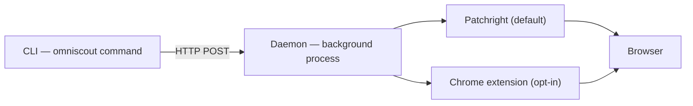

OmniScout 由三部分组成：

1. **CLI** — 你键入的 `omniscout` 命令（Typer + Rich）。解析参数并打印人类可读或 JSON 输出。
2. **Daemon** — `127.0.0.1:7720` 上的常驻 HTTP 服务，持有浏览器标签页、热加载的 embedding 模型与向量存储。
3. **后端** — Patchright（默认）或 Chrome 扩展（可选），真正操作浏览器。

daemon 在命令之间保持存活，浏览器、模型与索引始终热启动 — 每个操作都是亚秒级，无需按次支付启动成本。

## 核心概念

### `@eN` ref

`snapshot` 返回页面的无障碍树，元素带有稳定的 ref（`@e1`、`@e2`……）。操作针对 ref — `click '@e3'`、`fill '@e5' "text"` — 因此流程不受 CSS 与布局变化影响。导航后 ref 会失效：每次页面变化后重新 snapshot。见[浏览器自动化](/docs/cli/browser)。

### Daemon

用 `omniscout daemon start` 启动一次；未运行时多数命令会自动启动。daemon 持有：

- **操作队列** — 每个会话一条有序的浏览器命令流。
- **Snapshot 代次** — 每次 `snapshot` 锁定下一次操作解析所依据的 ref 代次。
- **操作历史与回放** — 最近 10k 条命令的 JSONL（`daemon trace`），可重跑（`daemon replay`），可录制为 macro（`record`/`macro`）。
- **会话恢复** — 重启后会话与 profile 可重新挂载。
- **事件流** — 实时 SSE（`daemon watch`），用于监控 agent。

### 后端

- **Patchright**（默认） — OmniScout 使用持久 profile 启动自带 Chromium。隔离、零配置。
- **Extension**（可选） — 驱动你真实的 Chrome/Brave，使用真实登录态与扩展。用 `omniscout setup --browser <id>` 配置；若弹窗显示 `backend_unavailable`，检查 `chrome://extensions`，或去掉 `--backend extension` 回退到 Patchright。

### 会话

`--session` 名称是 live daemon 内的标签页组 — 并行工作流共享同一 daemon 而互不干扰。用 `omniscout session …` 管理。见 [Daemon 与会话](/docs/cli/sessions)。

### Profile

`--profile` 名称是磁盘上的持久 user-data-dir — cookie 与登录态在重启后保留。`omniscout profile create work`，之后处处 `--profile work`，通过 `browser login` 登录一次。见 [Daemon 与会话](/docs/cli/sessions)。

## 引擎与存储层

| 层 | 职责 |
|---|---|
| `commands/` | CLI 子命令（search、browser、computer……） |
| `engines/` | 浏览器、搜索、研究、提取、抓取逻辑 |
| `daemon/` | HTTP 服务、后端、回放、事件流 |
| `store/` | SQLite 缓存、会话、工作流、记忆 |
| `models.py` | Pydantic JSON 约定（`--json` 的结构） |

一次 research 调用的数据流：`research` → 搜索引擎 → 抓取器 → 提取器 → 本地重排序（sentence-transformers）→ 总结器 → CLI 输出，页面缓存于 `cache/pages/`，记忆存于 `memory.sqlite` + 本地 Qdrant。

## 数据位置

| 平台 | 路径 |
|---|---|
| macOS | `~/Library/Application Support/omniscout/` |
| Linux | `~/.local/share/omniscout/` |

用 `OMNISCOUT_DATA_DIR` 覆盖。完整布局与所有配置键见[配置](/docs/cli/configuration)。
