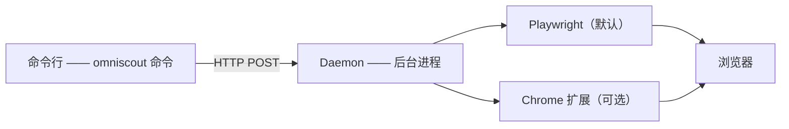

OmniScout 由三部分组成：

1. **命令行**——你输入的 `omniscout` 命令
2. **Daemon**——让浏览器保持打开的常驻后台进程
3. **后端**——Playwright（默认）或 Chrome 扩展

## 核心概念

### `@eN` 引用

运行 `snapshot` 时，OmniScout 会返回页面的无障碍树及稳定的元素引用（`@e1`、`@e2`、……）。用它们来点击、填写或交互——它们不受 CSS 变化影响。

### Daemon

Daemon 让 Playwright 保持热启动，使每个操作都在亚秒级完成。用 `omniscout daemon start` 启动一次即可。

### 后端

- **Playwright**（默认）：OmniScout 使用持久配置文件启动自带的 Chrome
- **Chrome 扩展**（可选）：驱动你的真实 Chrome，使用真实登录态

### 配置文件

持久浏览器配置文件保存 Cookie 和登录状态。用 `omniscout profile create work` 创建一个，然后在每条命令中使用 `--profile work`。

## 数据位置

| 平台 | 路径 |
|---|---|
| macOS | `~/Library/Application Support/omniscout/` |
| Linux | `~/.local/share/omniscout/` |

可用 `OMNISCOUT_DATA_DIR` 覆盖。
