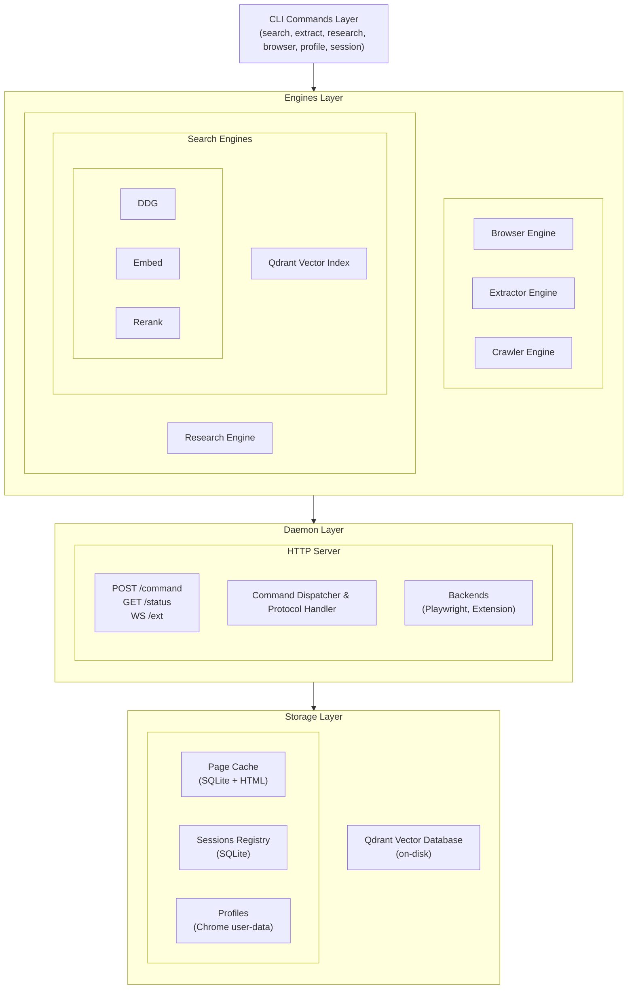

# OmniScout architecture

OmniScout is built around three architectural decisions:

1. **A long-lived local daemon** holds Playwright (or a WebSocket
   connection to the Chrome extension) open so per-action latency is
   sub-second. The CLI is a thin HTTP client into the daemon.
2. **Two interchangeable backends** sit behind the same JSON action
   vocabulary — `Playwright` (default, launches its own Chrome) and
   `Extension` (opt-in, drives the user's real Chrome via the MV3
   extension and `chrome.debugger`).
3. **Stable element refs** (`@e1`, `@e2`, ...) come from the
   accessibility tree, not CSS selectors — so an agent can re-use refs
   across calls without re-snapshotting after every click.

The rest of this page walks through the layers and the data flow.

## System Overview



## Action vocabulary

Every action a browser-using agent needs maps to exactly one CLI verb.
The same vocabulary is implemented by both backends.

| Verb | What it does |
|---|---|
| `navigate` | Open a URL in the active (or new) tab. |
| `snapshot` | Return the accessibility tree with stable `@eN` refs. |
| `click` | Click a `@eN` ref, CSS selector, or `(x, y)`. |
| `fill` | Set a textbox / `contenteditable` value. |
| `scroll` | Scroll page or an element. |
| `key` | Press a keyboard combo. |
| `hover` | Hover an element or coordinate. |
| `upload` | Attach files to an `<input type=file>`. |
| `screenshot` | Save a PNG/JPEG of the viewport or element. |
| `pdf` | Render the page to a PDF. |
| `eval` | Run JS in the active page. |
| `wait` | Wait for ref / URL pattern / network idle / N ms. |
| `tab list|close|switch` | Multi-tab in a single session. |
| `network start|stop|list|detail` | CDP-based request capture with filtering. |
| `login` | Headful interactive login with URL-pattern polling. |
| `captcha` | Detect (default) or solve via opt-in third-party API. |
| `close` | Close session or all sessions. |

## The two backends

Both backends implement the same `Backend` Python ABC, so the daemon
dispatcher is identical regardless of which one a session uses.

| | Playwright backend (default) | Extension backend (opt-in) |
|---|---|---|
| What it drives | OmniScout-launched Chrome | The user's running Chrome |
| Profile | Persistent dir in `profiles/` | The user's own profile |
| Logins | Per-OmniScout-profile cookies | Real logins from the user's browser |
| Setup | Nothing | Load unpacked `extension/` once |
| Visible to user? | Off-screen by default, headful with `--headful` | Always — overlay banner on controlled tabs |
| Best for | Headless CI, server-side agents, isolated profiles | Local dev agents needing real auth and real extensions |
| Doesn't support | — | `pdf`, `upload` |

The daemon resolves which backend to use per-session: the first
`navigate` call binds the session, and every subsequent action with the
same `--session NAME` routes there. Add `--backend extension` to a
session's first call to opt into the extension explicitly; otherwise the
daemon uses Playwright.

## Snapshot & `@eN` refs

OmniScout's snapshot model is the same idea as Kimi WebBridge's: instead of
asking agents to write CSS selectors (which break the moment a Tailwind
class hash changes), expose the page as its accessibility tree and give
every interactive element a short stable ref.

The flow on each `snapshot`:

1. Daemon calls `Accessibility.getFullAXTree` over CDP on the active
   page.
2. `_ax_node_to_snapshot` walks the tree and mints `@e1`, `@e2`, ... in
   document order for any node whose role is *not* in `SKIP_REF_ROLES`
   (skips `statictext`, `inlinetextbox`, `none`, `presentation`,
   `generic`, `linebreak`, `ignored`).
3. The `RefRegistry` caches each ref → CDP `backendDOMNodeId` mapping
   per session, with a configurable TTL.
4. `click`, `fill`, `hover`, etc. resolve refs back to Playwright
   locators via `get_by_role(role, name=...)`, falling back to CDP
   node-ID dispatch when role+name aren't unique.

Refs survive across calls until the next `navigate`. After a navigation
the registry is reset and the next `snapshot` mints fresh refs.

## Action queue

Two concurrent calls hitting the same session would race over the same
Playwright `Page` (or the same extension-controlled tab). OmniScout serialises
them with a per-session `asyncio.Lock`:

```python
state = await self._ensure_session(session)
async with state.action_lock:
    # ... verb body
```

Calls to **different** sessions still run in parallel — the lock is per
session, not per backend. Three verbs are carved out and run **without**
the lock by design:

| Verb | Why it's carved out |
|---|---|
| `close_session` | Tears down the state that owns the lock. |
| `login` | Blocks for minutes waiting for a human; holding the lock would deadlock `login_done`. |
| `login_done` | Signalling counterpart to `login`; must run while `login` is still polling. |

For agents, this means: it's safe to pipeline actions against the same
session. They won't interleave.

## Snapshot generations

Every session carries a monotonically increasing
`snapshot_generation` counter. It's bumped whenever something invalidates
the cached `@eN` refs:

- `snapshot` (the obvious one — a new ref set is minted)
- `navigate` (URL change wipes the page DOM)
- `switch_tab` / `close_tab`-of-active (active page changes)

Every action response carries the current value in `data.snapshot_generation`.
The contract for agents is simple:

> If `snapshot_generation` in the response differs from the value your
> last `snapshot` call returned, re-snapshot before using any `@eN` ref.

This is documented on the agent skill page and on the `SnapshotResult`
Pydantic model. It eliminates the "I clicked a ref and got `no_such_ref`"
class of agent bug.

## Action history

Every command the daemon handles (success or failure) writes one row to a
JSONL ring buffer at `$OMNISCOUT_DATA_DIR/daemon/actions.jsonl`. When the
file crosses 10,000 rows it's rotated atomically to `actions.prev.jsonl`.

Each row:

```json
{
  "action_id": "8f3a7c9e1b2d4e5f",
  "ts": "2026-05-26T19:00:42.123456Z",
  "elapsed_ms": 42,
  "ok": true,
  "session": "default",
  "action": "click",
  "args": {"selector": "@e3"},
  "snapshot_generation": 18,
  "error_kind": null,
  "error": null,
  "backend": "playwright"
}
```

The `action_id` is also returned on the `Response` envelope so agents and
tests can correlate. Two commands surface this log:

- `omniscout daemon trace [-n N] [--session NAME] [--action VERB] [--since SECONDS] [--prev]`
  prints a Rich table (or `--json` array) of recent rows.
- `omniscout daemon trace last` is a shorthand for "give me the most recent
  row as JSON".

And one command reads from it to re-run actions:

- `omniscout daemon replay <action_id>` re-POSTs that single row to the
  daemon.
- `omniscout daemon replay --session NAME --since 60` re-runs every
  replayable action for NAME inside a time window. Interactive verbs
  (`login`, `login_done`, `captcha_solve`, `upload`) are skipped unless
  you pass `--include-interactive`.

Replays go through the normal `/command` path so they're logged again —
the original `action_id` is preserved in the result under
`source_action_id` so you can trace the lineage.

## Session restore

Sessions used to live only in `PlaywrightBackend._sessions` (an in-memory
dict). Restart the daemon and every agent's session evaporated.

Today the daemon persists `{session_name → {profile, last_url, backend,
headful}}` to `$OMNISCOUT_DATA_DIR/daemon/sessions.json` whenever a session
successfully navigates or is explicitly closed:

```json
{
  "version": 1,
  "sessions": {
    "work": {
      "profile": "work-profile",
      "backend": "playwright",
      "headful": true,
      "last_url": "https://news.ycombinator.com",
      "updated_at": 1748286042.123
    }
  }
}
```

On `PlaywrightBackend.start()` the daemon reads the file and marks each
session as **dormant**. We deliberately do NOT eagerly re-launch every
context — a user with 20 stored sessions wouldn't want 20 Chromium
processes spawned at boot. Instead, the first verb that targets a dormant
session triggers a lazy restore: the context is launched, the previous
URL is re-loaded, then the verb runs. The agent sees a bumped
`snapshot_generation` so any stale refs are obviously invalid.

Extension-backed sessions are inherently tied to live Chrome tabs and
aren't restored automatically. The daemon remembers their name but errors
with `backend_unavailable` if you reference one before the extension has
reconnected.

## Event stream

`GET /events` is a Server-Sent Events channel. Subscribers see live
notifications about everything the daemon does:

| Event type | Emitted when |
|---|---|
| `action.start` | `POST /command` accepted, before dispatch |
| `action.finish` | After dispatch, with `ok`, `elapsed_ms`, `snapshot_generation` |
| `session.opened` | First time the daemon sees a new session name |
| `session.closed` | Session torn down by `close_session` |
| `extension.connected` | MV3 extension finished the WS handshake |
| `extension.disconnected` | Extension WS closed (e.g. browser quit) |

Each frame is a single JSON object:

```text
data: {"type":"action.start","ts":"2026-05-26T19:00:42.123Z","data":{"action_id":"8f3a7c9e...","session":"default","action":"click"}}
```

`omniscout daemon watch [--filter TYPE]` is a small CLI that subscribes
and pretty-prints (or `--json-lines` for one JSON object per line). The
extension popup uses the same channel to mirror live activity.

The bus is in-memory and per-daemon — there's no persistence layer. If
you want durable records, use the action history (above); if you want
live updates, use `/events`.

## Core Layers

### 1. Commands Layer (`omniscout/commands/` — internal Python package)

Thin CLI wrappers that delegate to engines. Each command:
- Parses CLI arguments via Typer
- Calls appropriate engine function
- Formats output (JSON or rich console)
- Handles errors and logging

**Command Modules:**
- `search.py` - Query DuckDuckGo with optional reranking
- `extract.py` - Fetch and extract URL content
- `research.py` - Multi-step research pipeline
- `browser.py` - Browser automation (navigate, click, fill, etc.)
- `profile.py` - Manage persistent browser profiles
- `session.py` - Manage long-lived browser sessions
- `daemon.py` - Start/stop/manage daemon

### 2. Engines Layer (`omniscout/engines/` — internal Python package)

Core processing logic, independent of CLI. Engines are reusable and can be called from Python code.

#### Browser Engine (`browser.py`)

Wraps Playwright for browser automation with two operational modes:

**One-Shot Mode:**
- Open persistent context
- Perform action (navigate, screenshot, etc.)
- Close context
- Profiles stored at `~/.config/omniscout/profiles/<name>/`
- Cookies and login state persist across invocations

**Long-Lived Session Mode:**
- Launch Chromium with remote debugging port
- Record PID and CDP WebSocket endpoint
- Return immediately
- Other tools can attach via WS endpoint
- Session registry in SQLite

**Key Features:**
- Automatic Chrome detection (system Chrome → bundled Chromium fallback)
- Profile management with persistent storage
- Session lifecycle management
- Headful/headless modes

#### Extractor Engine (`extractor.py`)

Fetches URLs and extracts clean, readable content:

1. **Fetch HTML**
   - Try httpx (fast, no JS rendering)
   - Fall back to Chrome for JS-heavy sites
   - Check on-disk cache first (by content hash)

2. **Extract Content**
   - Use trafilatura to remove boilerplate
   - Convert to markdown/text/JSON
   - Extract metadata (title, author, published date)
   - Collect links

3. **Cache Result**
   - Store HTML by SHA256 hash
   - Metadata in SQLite (URL → SHA256 mapping)
   - Avoid re-fetching same content

#### Crawler Engine (`crawler.py`)

Async HTTP crawler with intelligent fallbacks:

**Features:**
- Async httpx for concurrent fetching
- Per-host throttling (configurable delay)
- robots.txt respect (cached per-origin)
- Chrome fallback for JS-shell pages
- URL deduplication in-memory
- Configurable concurrency and timeouts

**Usage:**
```python
from omniscout.engines.crawler import crawl_many

results = await crawl_many(
    urls=["https://example.com", ...],
    max_concurrent=5,
    throttle_seconds=1.0
)
```

#### Research Engine (`research.py`)

Orchestrates full research pipeline:

1. **Search** - Query DuckDuckGo for top URLs
2. **Crawl** - Fetch all URLs (async, with throttling)
3. **Extract** - Extract readable content from each URL
4. **Chunk** - Split documents into ~220-word passages
5. **Embed** - Generate embeddings using sentence-transformers
6. **Index** - Upsert passages to Qdrant vector database
7. **Rerank** - Score passages by cosine similarity to topic
8. **Summarize** - Extract summary using TextRank

**Output:** Structured `ResearchReport` with sources and passages

#### Search Engines (`engines/search/`)

**DDG Search** (`ddg.py`):
- Fetch DuckDuckGo HTML results
- Parse and unwrap redirect URLs
- Extract title, snippet, URL

**Embeddings** (`embed.py`):
- Use sentence-transformers (all-MiniLM-L6-v2)
- L2-normalize vectors
- Batch processing for efficiency

**Vector Index** (`index.py`):
- Embedded Qdrant (no external server)
- On-disk storage at `~/.local/share/omniscout/qdrant/`
- Upsert passages with metadata
- Similarity search

**Reranking** (`rerank.py`):
- Cosine similarity scoring
- Sort results by relevance
- Optional threshold filtering

**Pipeline** (`pipeline.py`):
- Combine sources: DDG-only, index-only, or hybrid
- Deduplication across sources
- Unified result format

### 3. Daemon Layer (`omniscout/daemon/` — internal Python package)

Long-lived HTTP+WebSocket server for stateful browser control.

#### Server (`server.py`)

**Endpoints:**
- `POST /command` - Agent-facing command channel
- `GET /status` - Health check and introspection
- `GET /healthz` - Cheap liveness check
- `WS /extension` - Chrome MV3 extension bridge

**Command Dispatch:**
```
Command envelope → _dispatch() → Backend method → Response envelope
```

**Supported Actions:**
- `navigate` - Go to URL
- `click` - Click element
- `fill` - Fill form field
- `scroll` - Scroll page
- `key` - Press keyboard combo
- `hover` - Hover element
- `upload` - Upload files
- `screenshot` - Take screenshot
- `pdf` - Generate PDF
- `snapshot` - Get interactive elements

#### Protocol (`protocol.py`)

Versioned wire format for CLI ↔ Daemon communication:

```python
class Command(BaseModel):
    action: str              # e.g., "click"
    args: dict[str, Any]     # Action-specific arguments
    session: str             # Session ID (default: "default")
    timeout_ms: int | None   # Per-call timeout

class Response(BaseModel):
    ok: bool                 # Success flag
    action: str              # Echo of action
    data: dict | None        # Result data
    error: str | None        # Error message
    error_kind: str | None   # Machine-readable error category
    elapsed_ms: int | None   # Execution time
```

**Protocol Version:** "1" (versioned for compatibility)

#### Backends (`daemon/backends/`)

**Playwright Backend** (`playwright.py`):
- Default backend for browser control
- Uses Playwright's Chromium or system Chrome
- Manages page contexts and sessions

**Extension Backend** (`extension.py`):
- Optional Chrome MV3 extension integration
- Allows extension-driven browser control
- WebSocket bridge for extension communication

#### Lifecycle (`lifecycle.py`)

Manages daemon process:
- Auto-start on first CLI invocation (lazy)
- Port detection and storage
- Health checks
- Graceful shutdown

### 4. Storage Layer (`omniscout/store/` — internal Python package)

Persistent data management.

#### Page Cache (`store/cache.py`)

**Design:**
- Content-hashed storage (SHA256 of HTML body)
- Handles redirects transparently
- Metadata in SQLite

**Schema:**
```sql
CREATE TABLE pages (
    url TEXT PRIMARY KEY,
    sha256 TEXT NOT NULL,
    status INTEGER,
    content_type TEXT,
    fetched_at TEXT NOT NULL
);
```

**Usage:**
```python
cache = PageCache()
cached = cache.get("https://example.com")
if cached:
    html = cached.body
else:
    html = fetch_html("https://example.com")
    cache.put("https://example.com", html, status=200)
```

#### Session Registry (`store/sessions.py`)

**Design:**
- SQLite registry of long-lived browser sessions
- Tracks PID, CDP WebSocket endpoint, profile, status

**Schema:**
```sql
CREATE TABLE sessions (
    id TEXT PRIMARY KEY,
    profile TEXT,
    pid INTEGER,
    ws_endpoint TEXT,
    headful INTEGER NOT NULL DEFAULT 0,
    started_at TEXT NOT NULL,
    status TEXT NOT NULL DEFAULT 'running'
);
```

**Usage:**
```python
store = SessionStore()
session = store.register(
    profile="default",
    pid=12345,
    ws_endpoint="ws://127.0.0.1:9222/...",
    headful=False
)
```

### 5. Configuration (`config.py`)

XDG-compliant paths and settings.

**Paths:**
```python
@dataclass
class Paths:
    data: Path              # ~/.local/share/omniscout/
    config: Path            # ~/.config/omniscout/
    cache: Path             # ~/.cache/omniscout/
    profiles: Path          # data/profiles/
    qdrant: Path            # data/qdrant/
    page_cache: Path        # cache/pages/
    cache_db: Path          # cache/cache.sqlite
    sessions_db: Path       # data/sessions.sqlite
```

**Settings (from config.toml):**
```python
@dataclass
class Settings:
    default_source: str = "ddg"
    search_limit: int = 10
    research_results: int = 8
    research_depth: int = 1
    request_throttle_seconds: float = 1.0
    embedding_model: str = "sentence-transformers/all-MiniLM-L6-v2"
    qdrant_collection: str = "scout_passages"
    summary_sentences: int = 6
    browser_channel: str = "chrome"  # or "chromium"
    browser_executable: str | None = None
```

### 6. Models (`models.py`)

Pydantic result types define the JSON contract:

**Search:**
- `SearchHit` - Single result
- `SearchResponse` - Collection of hits

**Extraction:**
- `ExtractResult` - Extracted content with metadata

**Research:**
- `ResearchReport` - Full research output
- `ResearchSource` - Source URL
- `ResearchPassage` - Ranked passage

**Browser:**
- `BrowserActionResult` - Action result
- `SnapshotResult` - Interactive elements
- `ScreenshotResult` - Screenshot metadata
- `PdfResult` - PDF generation result

**Sessions:**
- `SessionInfo` - Session metadata
- `ProfileInfo` - Profile metadata
- `TabInfo` - Tab information

**Daemon:**
- `DaemonStatus` - Daemon health and status

## Data Flow Patterns

### Search Flow

```
CLI (search.py)
  ↓
search_pipeline()
  ├─ ddg.search(query)
  │   ├─ httpx.get(duckduckgo.com)
  │   ├─ parse HTML
  │   └─ return SearchHit[]
  ├─ [optional] rerank.rerank(query, hits)
  │   ├─ embed_texts([query] + snippets)
  │   ├─ cosine_similarity()
  │   └─ sort by score
  └─ return SearchResponse
  ↓
Output (JSON or rich table)
```

### Extract Flow

```
CLI (extract.py)
  ↓
extract_url(url)
  ├─ PageCache.get(url)
  │   └─ [if cached] return CachedPage
  ├─ [if not cached] _fetch_html(url)
  │   ├─ httpx.get(url)
  │   └─ [on JS-heavy] BrowserEngine.render(url)
  ├─ PageCache.put(url, html)
  ├─ extract_html(html)
  │   ├─ trafilatura.extract()
  │   ├─ markdownify()
  │   └─ extract metadata
  └─ return ExtractResult
  ↓
Output (Markdown, text, or JSON)
```

### Research Flow

```
CLI (research.py)
  ↓
run_research(topic)
  ├─ ddg.search(topic)
  │   └─ return top URLs
  ├─ crawl_many(urls)
  │   ├─ async httpx.get() per URL
  │   ├─ [on JS-heavy] Chrome fallback
  │   └─ return HTML[]
  ├─ extract_html() per URL
  │   └─ return ExtractResult[]
  ├─ _chunk() per document
  │   └─ split at paragraph/sentence boundaries
  ├─ embed_texts(chunks)
  │   ├─ sentence-transformers
  │   └─ return embeddings[]
  ├─ index.upsert(passages)
  │   └─ Qdrant.upsert()
  ├─ rerank passages
  │   ├─ embed(topic)
  │   ├─ cosine_similarity()
  │   └─ sort by score
  ├─ _extract_summary(top_passages)
  │   └─ sumy TextRank
  └─ return ResearchReport
  ↓
Output (JSON or rich panel)
```

### Browser Control Flow

```
CLI (browser.py)
  ↓
DaemonClient.post(action, args, session)
  ├─ lifecycle.ensure_running()
  │   └─ [if not running] start daemon
  ├─ httpx.post(http://127.0.0.1:7720/command)
  │   └─ send Command envelope
  ↓
Daemon (server.py)
  ├─ handle_command()
  ├─ _dispatch(backend, cmd)
  │   ├─ backend.navigate/click/fill/etc()
  │   └─ return result dict
  └─ send Response envelope
  ↓
CLI
  ├─ parse Response
  └─ output (JSON or rich)
```

### Session Lifecycle

```
CLI (session.py)
  ↓
BrowserEngine.session_start()
  ├─ subprocess.Popen([chrome, --remote-debugging-port=PORT])
  ├─ _wait_for_ws()
  │   └─ poll /json/version until CDP endpoint available
  ├─ SessionStore.register()
  │   └─ INSERT into sessions.sqlite
  └─ return SessionInfo
  ↓
Later: DaemonClient.post(..., session=ID)
  ├─ SessionStore.get(ID)
  ├─ connect via ws_endpoint
  └─ execute action
```

## Key Design Patterns

### 1. Lazy Initialization
- Daemon auto-starts on first browser command
- Embedding model loaded on first search
- Qdrant index created on first research

### 2. Fallback Chains
- **Fetching:** httpx (fast) → Chrome (JS rendering)
- **Browser:** system Chrome → bundled Chromium
- **Search:** DDG → local index → hybrid

### 3. Content Hashing
- Cache by SHA256 of HTML body, not URL
- Handles redirects transparently
- Deduplicates identical content

### 4. Per-Host Throttling
- Async crawler respects rate limits
- Configurable delay between requests
- Prevents overwhelming target servers

### 5. Stateless CLI
- All state lives in daemon or persistent storage
- CLI is thin, reusable wrapper
- Multiple CLI invocations can share daemon

### 6. Pydantic Models
- Single source of truth for JSON contract
- Type-safe result handling
- Automatic validation and serialization

### 7. XDG Compliance
- Respects platform-specific data/config/cache directories
- Portable across macOS, Linux, Windows
- User-configurable via environment variables

### 8. Process-Wide Singletons
- Embedding model (amortized loading)
- Qdrant client (persistent connection)
- Playwright browser instance (reused across commands)

### 9. Versioned Protocol
- Command/Response envelopes with protocol_version
- Clients refuse to talk to incompatible daemons
- Enables safe upgrades

## Extension Points

### Adding a New Search Source

1. Create `engines/search/newsource.py`
2. Implement `search(query: str) -> list[SearchHit]`
3. Update `pipeline.py` to include new source
4. Add CLI option `--source newsource`

### Adding a New Browser Backend

1. Create `daemon/backends/newbackend.py`
2. Implement `Backend` interface
3. Update `server.py` to instantiate backend
4. Add backend detection logic

### Adding a New Command

1. Create `commands/newcommand.py`
2. Define Typer app with subcommands
3. Call appropriate engine function
4. Add to `app.py` via `app.add_typer()`

## Performance Considerations

- **Caching:** Page cache reduces network calls
- **Async:** Crawler uses asyncio for concurrent fetching
- **Lazy Loading:** Models and indices loaded on-demand
- **Batch Processing:** Embeddings computed in batches
- **Connection Pooling:** httpx and Playwright reuse connections
- **Local Processing:** No network round-trips for search/rerank

## Security Considerations

- **No Cloud APIs:** All data stays local
- **User-Agent Spoofing:** Realistic user-agent to avoid detection
- **robots.txt Respect:** Ethical crawling
- **Timeout Protection:** Prevents hanging on slow servers
- **Input Validation:** Pydantic models validate all inputs
- **Process Isolation:** Daemon runs as separate process
